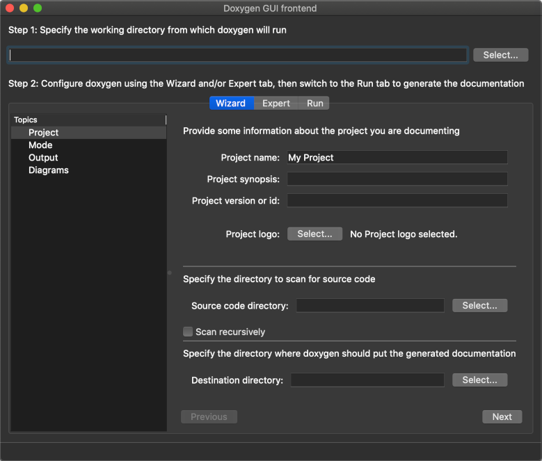

# Doxygen: DoxyWizard for macOS

The official DoxyWizard for macOS is built against Qt 4. It does not support retina displays nor Mojave's dark mode. This fork contains the scripts I use to compile it myself.

